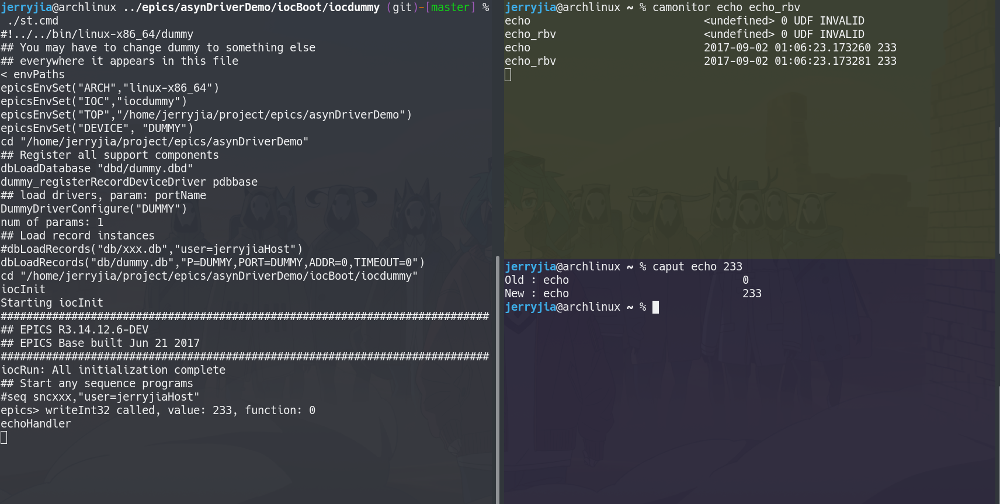

[asyn](https://github.com/epics-modules/asyn) C++ interface (asynPortDriver) usage demo.

It uses `ioc` type template.

PV names: `echo`, `echo_rbv`
You can start ioc shell in terminal A, `camonitor echo echo_rbv` in terminal B, `caput echo <num>` in terminal C, and check output in terminal A B.

Only support C++14 compatible compilers

## How to add PV
Suppose I want to add longin/longout pv echo/echo\_rbv. (rbv: reedback value)

### 1. Define binding
Define `param string` to bind with pv(s) (e.g. `DUMMY_ECHO`) in your heart or documentaion. We will use it later

In normal epics ioc, we will bind DTYP, device dbd, c struct, and INP/OUT field map to function handler or value.

In asyn drvier, we will bind `param string`,`param value` in c source and its header

### 2. Define Record
Define record (see 'dummyApp/Db/dummy.db'), we should set string `asyn(...DUMMY_ECHO)` in INP/OUT field. In DTYP we use `asynInt32`. We can use `asynXXXX` which is defined in its documentation.

After this step, we can map `param string` to pv(s).

Note that we set `I/O Intr` in **input** (longin,ai,bi,stringin,etc) type **`SCAN`** field.

### 3. Inherit asynPortDriver
We should define our class and override asynPortDriver virtual functions, it has doxygen documentation.

### 4. Define Value
Define value in c++ sources (see sources under 'dummyApp/src/'), we need to define `int` type index for our `param value`.

And in constructor, we use `createParam(<param string>, <param type>, <param value index>)` to bind record's `param string` with our internal `param value`, the `param vlaue index` will be initialized. Then we can use `setXXXParam`,`getXXXParam` with `param value index` to read/write our internal `param value`.

`param value` is variable which will be exposed to IOC.

### 5. Define Handler
For **output** (longout,ao,bo,stringout,etc) type PV, we may need to write a handler. asynPortDriver gives us interface like `writeInt32`. These functions will only be called when one record is processing. These functions will give us `param value index` (we defined and initialized in step 4) to indicate which record is processing.

Do not forget to call `callParamCallbacks()`, it help us deal with **input** Record process with SCAN `I/O Intr`.

diagram:

`caput call -> <param_string> -> asynPortDriver interface -> <param_value_index> -> our handler -> <param_value>`

### 6. Setup ioc shell
We can define ioc shell function. Then in cmd file we can call this ioc shell function to create our driver

## Tips
* Do not forget set environment variables to make EPICS ugly build system find base and asyn.
* Do not forget adding db files into Makefile
